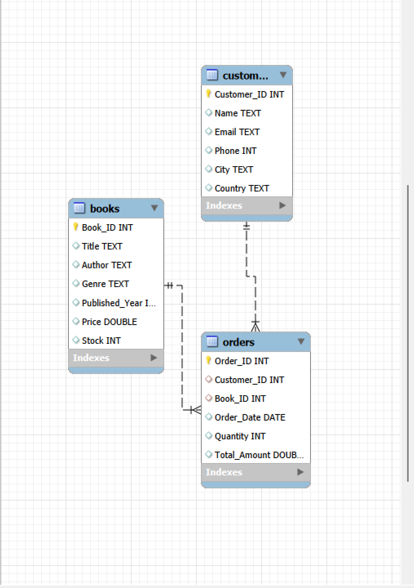
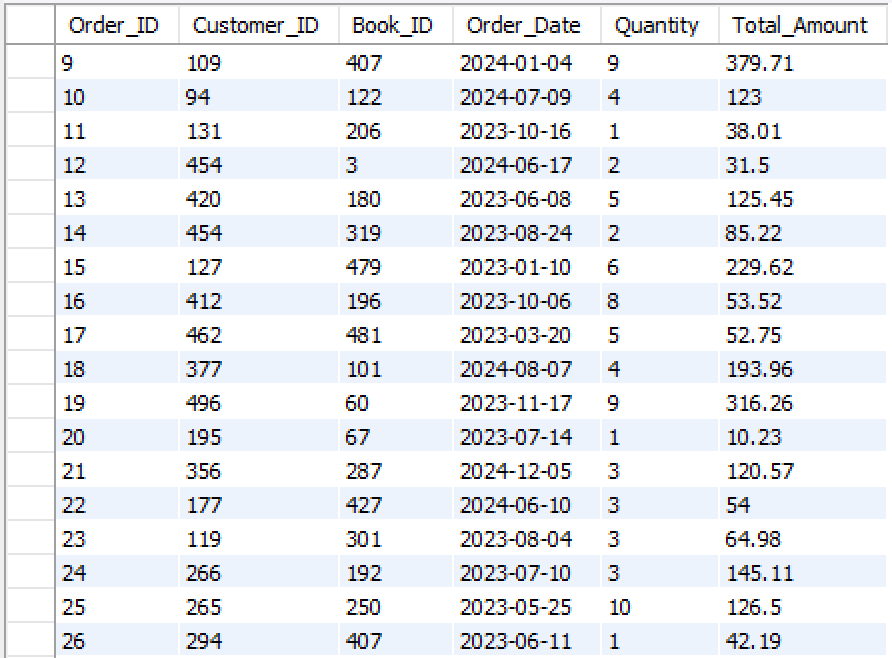
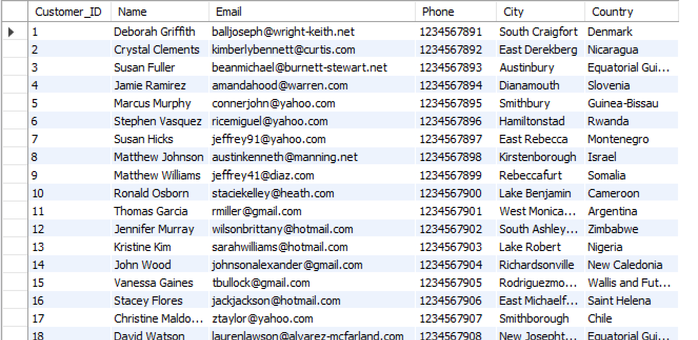
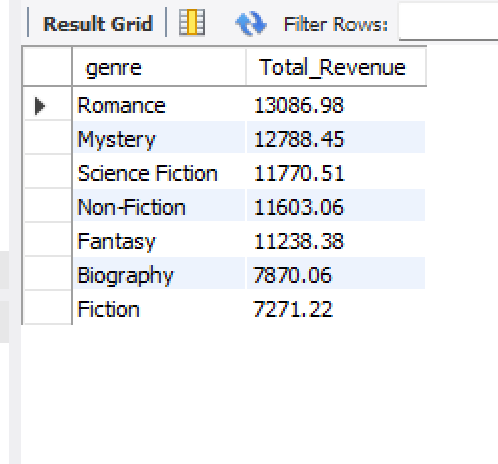
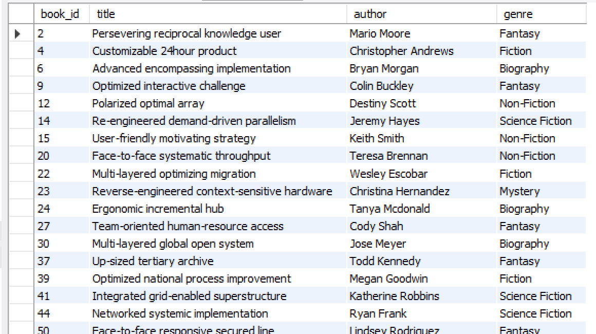
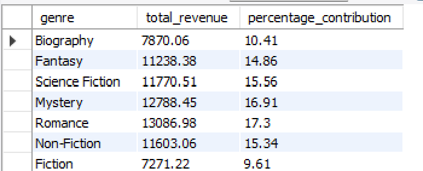

#  SQL Online Book Store Analysis

## Overview

This project focuses on analyzing an online book store database using SQL to answer real-world business questions. The goal was not only to practice SQL syntax but also to understand how data can be used to generate meaningful business insights.

The database contains information about books, customers, and orders. By combining these tables with SQL queries, I explored customer purchasing behavior, book sales, revenue trends, and inventory-related insights.

This project helped me strengthen my understanding of SQL while approaching problems from a business perspective.

---

## 📌 Project Highlights

* Solved 40+ SQL business questions using an online book store database.
* Applied SQL concepts including JOINs, Aggregate Functions, Subqueries, CTEs, and Window Functions.
* Performed customer, sales, and revenue analysis to answer real-world business questions.
* Designed and documented the database schema using an EER diagram.
* Published the complete project on GitHub with datasets, SQL scripts, and documentation.

## Objectives

* Practice writing SQL queries using a relational database.
* Perform data analysis to answer business-related questions.
* Improve skills in joins, aggregate functions, subqueries, and window functions.
* Build a portfolio project that demonstrates practical SQL knowledge.

---

## Database Schema



The project consists of three main tables:

* **Books** – Stores information about books such as title, author, genre, price, stock, and publication year.
* **Customers**   – Contains customer details including name, email, country, and city.
* **Orders**    – Records customer purchases, quantities, order dates, and references to books.

The Entity Relationship (ER) Diagram is available in the `screenshots` folder.

---

## Dataset

The datasets used in this project are included inside the `datasets` folder.

* books.csv
* customers.csv
* orders.csv

---

## SQL Concepts Used

Throughout this project, I worked with the following SQL concepts:

* SELECT statements
* Filtering using WHERE
* ORDER BY
* GROUP BY
* HAVING
* Aggregate Functions
* INNER JOIN
* LEFT JOIN
* Subqueries
* Common Table Expressions (CTEs)
* Window Functions
* CASE Statements
* Date Functions
* Ranking Functions
* String Functions
* Null Handling 

---

## 🛠️ Skills Demonstrated

This project helped me strengthen the following technical and analytical skills:

* SQL Query Writing
* MySQL
* Relational Database Design
* Data Analysis
* Joins (INNER JOIN, LEFT JOIN)
* Aggregate Functions
* Subqueries
* Common Table Expressions (CTEs)
* Window Functions
* Business Problem Solving
* Data Interpretation

---

## Business Questions Solved

This project answers several business-focused questions using SQL, including:

# Which books generate the highest revenue?

 # Who are the top customers based on total spending?
  

# Which genres contribute the most revenue?
  

# Which books have never been ordered?
  
  
# Which customers have never placed an order?

* Which country generates the highest revenue?
* Which author has generated the most sales?
* Which customers purchased books from multiple genres?

  
* What percentage of total revenue comes from each genre?
  
* Who are the top three customers in each country?

Overall, more than **40 SQL queries** were written to explore different business scenarios.

---

## 📈 Key Insights

After analyzing the online book store dataset, I identified several meaningful business insights:

* Identified the highest revenue-generating books and genres.
* Discovered the top customers based on total spending.
* Found books that had never been ordered, highlighting potential inventory issues.
* Analyzed each genre's contribution to overall revenue.
* Ranked the top customers within each country using SQL window functions.
* Explored customer purchasing patterns across multiple book genres.

These insights demonstrate how SQL can be used to support business decision-making through data analysis.


## Project Structure

```text
sql-online-book-store-analysis/
│
├── datasets/
│   ├── books.csv
│   ├── customers.csv
│   └── orders.csv
│
├── sql_queries/
│   └── online_book_store_analysis.sql
│
├── screenshots/
│   ├── eer_diagram.png
│   ├── books_table.png
│   ├── customers_table.png
│   ├── orders_table.png
│   └── ...
│
├── README.md
└── .gitignore
```

---

## Screenshots

The `screenshots` folder contains:

* Entity Relationship (ER) Diagram
* Books table
* Customers table
* Orders table
* Important SQL query outputs
* Business analysis results

---

## Key Learnings

Working on this project helped me improve my understanding of:

* Designing and querying relational databases
* Writing optimized SQL queries
* Performing business-focused data analysis
* Working with multiple tables using joins
* Using analytical SQL functions to solve real-world problems

More importantly, it gave me experience in converting raw data into meaningful insights that support business decision-making.

---

## 🚀 How to Use

Follow these steps to run this project on your local machine:

1. Clone this repository or download the project files.
2. Import the datasets (`books.csv`, `customers.csv`, and `orders.csv`) into MySQL.
3. Create the required database tables.
4. Execute the SQL script available in the `sql_queries` folder.
5. Run the queries individually to reproduce the analysis and explore the business insights.


---

## Tools Used

* MySQL
* MySQL Workbench
* Git
* GitHub
* visula Studio Code
---

## About This Project

This project was created as part of my SQL learning journey to strengthen my database and analytical skills. Instead of focusing only on writing SQL queries, I wanted to understand how SQL can be used to answer practical business questions using real-world datasets.

---

## 👨‍💻 Author

**Nithin Vandana**

This project was created as part of my data analytics learning journey to strengthen my SQL skills through practical, business-oriented problems.

Thank you for taking the time to explore this project. If you have any suggestions or feedback, feel free to connect with me through GitHub.
